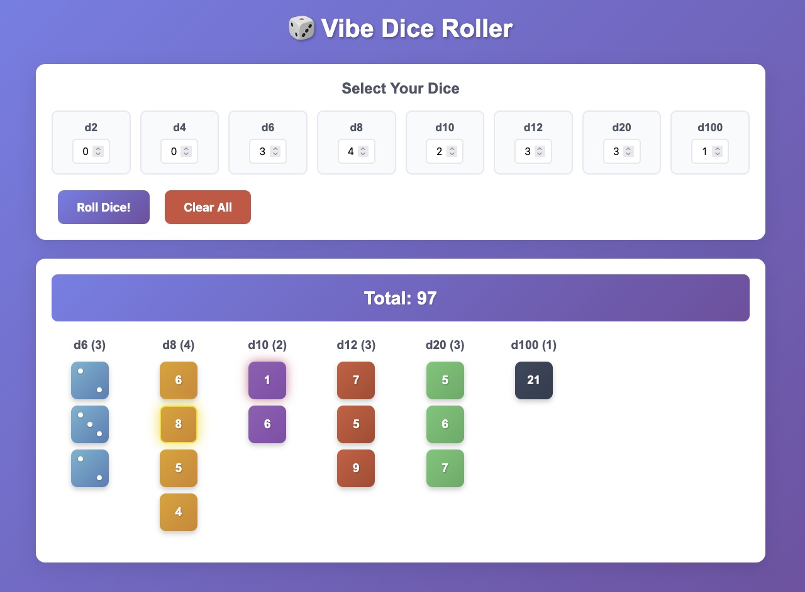

# 🎲 Vibe Dice Roller

*Experimental One-Shot with Claude Code to create a simple dice roller*

A beautiful, interactive web-based dice rolling application that supports all standard tabletop gaming dice types. Perfect for D&D, board games, or any situation where you need to roll dice!



## ✨ Features

- **Multiple Dice Types**: Roll d2, d4, d6, d8, d10, d12, d20, and d100 dice
- **Flexible Quantities**: Roll up to 20 dice of each type simultaneously
- **Beautiful Graphics**: Each dice type has unique colors and visual styling
- **Traditional d6 Display**: Classic dot patterns (pips) for six-sided dice
- **Roll Animations**: Smooth 3D rolling animations for visual appeal
- **Special Highlights**: 
  - Maximum rolls get a gold border and glow
  - Minimum rolls (1s) get a red glow effect
- **Automatic Totaling**: Running sum of all dice results
- **Responsive Design**: Works perfectly on desktop, tablet, and mobile
- **Keyboard Shortcuts**: 
  - Enter or Space to roll dice
  - Escape to clear all dice

## 🚀 Quick Start

1. **Clone or Download**: Get the files to your local machine
2. **Open**: Simply open `index.html` in any modern web browser
3. **Roll**: Select your dice and start rolling!

No installation, build process, or server required - it's a pure client-side application.

## 🎮 How to Use

1. **Select Dice**: Use the number inputs to choose how many of each dice type you want to roll
2. **Roll**: Click the "Roll Dice!" button or press Enter/Space
3. **View Results**: See individual dice results grouped by type, plus the total sum
4. **Clear**: Use "Clear All" button or press Escape to reset

### Example Scenarios

- **D&D Character Stats**: Roll 4d6 to generate ability scores
- **Attack Rolls**: Roll 1d20 + damage dice like 1d8
- **Board Games**: Roll 2d6 for movement
- **Percentile Rolls**: Use d100 for percentage-based checks

## 🛠️ Technical Details

- **Pure HTML/CSS/JavaScript**: No frameworks or dependencies
- **Modern CSS**: Uses CSS Grid, Flexbox, and CSS animations
- **Responsive**: Mobile-first design with media queries
- **Accessible**: Keyboard navigation and semantic HTML
- **Cross-browser**: Works in all modern browsers

## 📁 File Structure

```
vibe-dice/
├── index.html      # Main HTML structure
├── styles.css      # All styling and animations
├── script.js       # Dice rolling logic and interactions
└── README.md       # This file
```

## 🎨 Customization

Want to modify the colors, add new dice types, or change the styling? Here's where to look:

- **Colors**: Modify the CSS gradient backgrounds in `styles.css` (search for `.die.d6`, `.die.d20`, etc.)
- **Animations**: Adjust the `@keyframes rollAnimation` in `styles.css`
- **Dice Logic**: Add new dice types by modifying the `diceTypes` array in `script.js`
- **Layout**: Modify the CSS Grid properties in `.dice-types` and `.dice-results`

## 🤝 Contributing

Feel free to submit issues, suggestions, or pull requests! Some ideas for enhancements:

- [ ] Sound effects for dice rolls
- [ ] Dice roll history/log
- [ ] Custom dice colors/themes
- [ ] Dice roll statistics
- [ ] Export results functionality
- [ ] Preset dice combinations (D&D spells, etc.)

## 📄 License

This project is open source and available under the [MIT License](LICENSE).

## 🎯 Original Project Requirements

This project was built to fulfill the following requirements:

> "I would like to create a basic web application that rolls dice. It should allow one to roll an arbitrary number of dice, d2, d4, d6, d8, d10, d12, d20, or d100. I don't have a programming language preference. The dice should be represented graphically in the browser window after the user selects which type and how many of each."

### Requirements Fulfilled:
- ✅ **Web application**: Pure HTML/CSS/JavaScript implementation
- ✅ **Roll arbitrary number of dice**: Up to 20 of each type
- ✅ **All dice types**: d2, d4, d6, d8, d10, d12, d20, d100 supported
- ✅ **User selection**: Input controls for type and quantity
- ✅ **Graphical representation**: Color-coded dice with visual styling
- ✅ **Enhanced features**: Added animations, totaling, and responsive design

## 🔗 Demo

[Live Demo](https://gitobic.github.io/vibe-dice-roller)

---

**Enjoy rolling!** 🎲✨

*Built with ❤️ for the tabletop gaming community*
